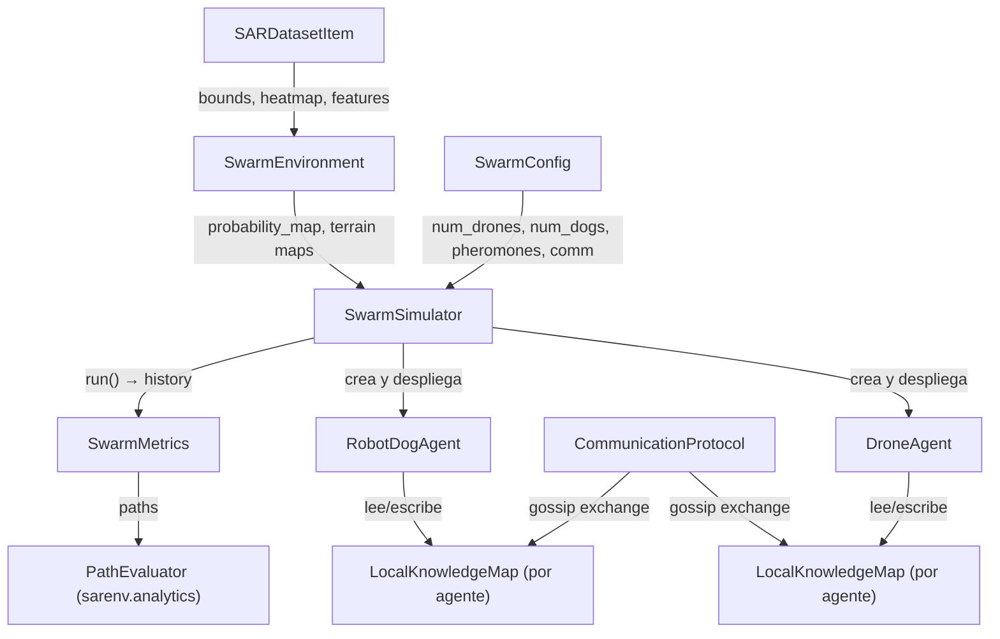
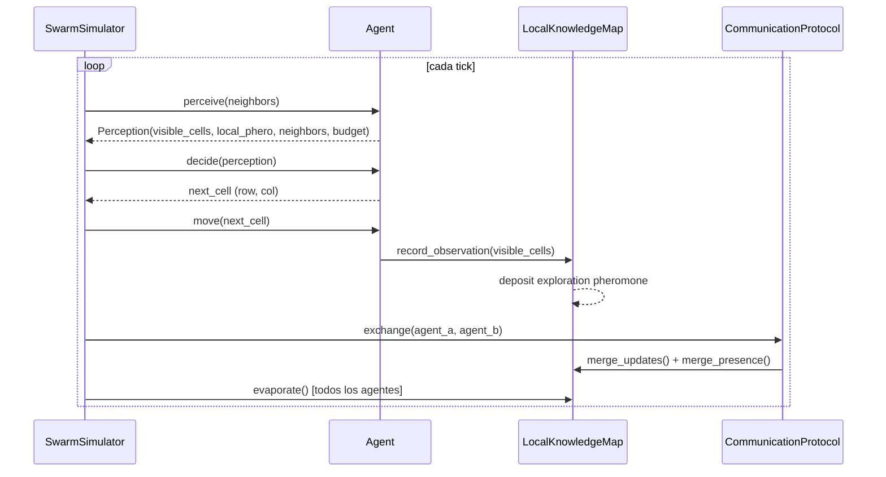

# `sarenv.swarm` — Multi-agent Swarm Module

Simulador de enjambre tick-based para misiones SAR con equipos heterogéneos de drones UAV y robots terrestres. La coordinación es **descentralizada**: no hay controlador central, el comportamiento emergente surge de feromonas virtuales y comunicación gossip entre agentes.

---

## Arquitectura general



---

## Flujo de un tick

Cada llamada a `SwarmSimulator.step()` ejecuta **6 fases en orden**:

```
1. PERCEPCIÓN     → cada agente observa las celdas en su radio de detección
2. DECISIÓN       → cada agente elige la siguiente celda (cadena de 4 prioridades)
3. MOVIMIENTO     → el agente se desplaza, consume budget
4. OBSERVACIÓN    → registra la celda actual en su LocalKnowledgeMap
5. COMUNICACIÓN   → gossip con agentes en rango comm_range
6. EVAPORACIÓN    → feromonas decaen en todos los mapas
```



---

## Archivos y responsabilidades

| Archivo | Clase principal | Qué hace |
|---|---|---|
| `config.py` | `SwarmConfig`, `DroneConfig`, `RobotDogConfig` | Todos los parámetros de la simulación en dataclasses |
| `environment.py` | `SwarmEnvironment` | Wrapper del dataset SAR → grid discreto con mapas de terreno |
| `knowledge.py` | `LocalKnowledgeMap`, `MapUpdate` | Mapa de conocimiento por agente: 3 capas de feromona + gossip buffer |
| `agents.py` | `BaseSwarmAgent`, `DroneAgent`, `RobotDogAgent` | Lógica de decisión y movimiento de cada tipo de agente |
| `communication.py` | `CommunicationProtocol` | Intercambio epidémico (gossip) entre pares en rango |
| `simulator.py` | `SwarmSimulator` | Motor del bucle principal (6 fases por tick) |
| `metrics.py` | `SwarmMetrics` | Métricas de cobertura, solapamiento, Gini por agente |
| `terrain.py` | — | Rasterización OSM → modificadores de detección y transitabilidad |
| `comparative.py` | `SwarmComparativeEvaluator` | Enjambre vs planificadores centralizados (Greedy, Pizza, Spiral) |
| `export.py` | — | Exportar escenario a CSV/GeoJSON para GAMA Platform |
| `gama_network_server.py` | `GamaNetworkServer` | Servidor TCP que envía el estado del enjambre a GAMA tick a tick |

---

## Estructura de datos clave

### `LocalKnowledgeMap` — el "cerebro" de cada agente

Cada agente tiene su **propia copia** del mundo. Contiene 4 capas:

```
probability_map   [H × W, float32]  — copia estática del heatmap inicial (no cambia)
exploration_map   [H × W, float32]  — feromona "ya pasé aquí" (0→1, evapora)
alert_map         [H × W, float32]  — feromona "aquí hay algo" (evapora más lento)
presence_field    [H × W, float32]  — feromona estigmérgica "agentes actuales"
```

El gossip propaga `exploration_map` y `alert_map` entre agentes en rango. `presence_field` se propaga por `merge_presence()` (max-merge).

### `Perception` — lo que el agente ve en un tick

```python
@dataclass
class Perception:
    visible_cells: set[tuple[int, int]]       # celdas dentro del radio de detección
    local_probability: dict[cell, float]      # prob del heatmap en esas celdas
    local_exploration: dict[cell, float]      # feromona exploración en esas celdas
    local_alert: dict[cell, float]            # feromona alerta en esas celdas
    neighbors: list[BaseSwarmAgent]           # agentes en comm_range
    budget_remaining: float
    position: tuple[int, int]
```

---

## Lógica de decisión del agente — 4 prioridades

El método `BaseSwarmAgent.decide(perception)` sigue una cadena estricta:

```
Prioridad 1  →  ¿Queda poco budget?  →  volver a base
Prioridad 1b →  ¿Tengo frontera comprometida?  →  seguir hacia ella
Prioridad 1c →  ¿Estancado (sin celdas nuevas N ticks)?  →  buscar frontera lejana
Prioridad 2  →  ¿Hay feromona de alerta cerca?  →  investigarla
Prioridad 3  →  Scoring greedy sobre celdas alcanzables:

    score(c) = prob(c)
             × (1 − exploration(c))
             − repulsion(c)              # 1/d^p sobre vecinos en comm_range
             − presence_penalty(c)       # feromona de presencia estigmérgica
             + exploration_bonus         # bonus para celdas nunca vistas
             + dispersal(c)              # Boids-separation con peers en gossip
             − ever_explored_penalty(c)  # hard-mask si ya fue explorada
             − anti_revisit_penalty(c)   # penaliza visitas recientes (anti-oscilación)

Prioridad 4  →  Fallback: paso aleatorio entre vecinos alcanzables
```

### Diferencia Drone vs RobotDog

| Aspecto | DroneAgent | RobotDogAgent |
|---|---|---|
| Radio de detección | `altitude × tan(fov/2)` (~33 m a 80 m / 45°) | `sensor_range` fijo (20 m) |
| Coste de movimiento | `grid.dx` por celda (terreno plano) | `grid.dx × traversability_cost[terrain]` |
| Detección modulada | Sí, peor en bosque por el dosel (`DETECTION_MODIFIERS["drone"]`, `woodland`≈0.15) | Sí, por tipo de terreno (`DETECTION_MODIFIERS["robot_dog"]`) |
| Pendiente máxima | Sin límite | `max_slope` (30°, definido pero no aplicado aún) |

---

## Protocolo gossip

```
Cada tick, por cada par (A, B) con distancia < comm_range:
  1. A envía a B sus MapUpdates recientes (alertas primero, FIFO, límite bandwidth)
  2. B envía a A lo mismo (bidireccional)
  3. Ambos hacen max-merge del presence_field del otro
  4. Ambos registran la posición del otro (para Boids-separation)

max_hops controla cuántos saltos se reenvía un update:
  max_hops=1  →  solo info propia (descentralizado puro)
  max_hops=999 →  info de toda la red (aproxima centralizado)
```

---

## Parámetros más importantes de `SwarmConfig`

| Parámetro | Valor por defecto | Efecto |
|---|---|---|
| `num_drones` | 3 | Número de UAVs |
| `num_dogs` | 0 | Número de robot dogs |
| `budget_per_agent` | 100 000 m | Distancia máxima por agente |
| `max_steps` | 5 000 | Límite de ticks |
| `evaporation_rate` | 0.01 | Cuánto decae la feromona de exploración por tick |
| `max_hops` | 1 | Profundidad del gossip |
| `bandwidth_limit` | 200 | Máx. updates por intercambio gossip |
| `DroneConfig.fov_deg` | 45° | Campo de visión de la cámara |
| `DroneConfig.altitude` | 80 m | Altitud de vuelo |
| `AgentConfig.dispersal_weight` | 0.0 | Separación tipo Boids (0 = desactivado) |
| `AgentConfig.ever_explored_penalty` | 0.0 | Hard-mask anti-revisita |

---

## Uso mínimo

```python
from sarenv.core.loading import DatasetLoader
from sarenv.swarm import SwarmConfig, DroneConfig, SwarmSimulator, SwarmMetrics

item = DatasetLoader("sarenv_dataset").load_environment("medium")

config = SwarmConfig(
    num_drones=3,
    num_dogs=2,
    budget_per_agent=100_000,
    drone_config=DroneConfig(altitude=80.0, fov_deg=45.0),
)

sim = SwarmSimulator.from_dataset_item(item, config, seed=42)
sim.run()

metrics = SwarmMetrics(sim)
summary = metrics.coverage_summary()
print(f"Cobertura:   {summary['coverage_ratio']:.1%}")
print(f"Solapamiento: {summary['overlap_ratio']:.1%}")
```

---

## Extensión: implementar tu propio algoritmo de decisión

Para comparar un algoritmo propio contra el enjambre bio-inspirado, subclasifica `BaseSwarmAgent` y sobreescribe `decide()`:

```python
from sarenv.swarm.agents import BaseSwarmAgent, Perception

class MyAgent(BaseSwarmAgent):
    def decide(self, perception: Perception | None = None, *, timestep: int = 0):
        if perception is None:
            perception = self.perceive([])
        reachable = self._get_reachable_neighbors()
        if not reachable:
            return None
        # Ejemplo: probabilidad pura, sin feromonas
        return max(reachable, key=lambda c: perception.local_probability.get(c, 0.0))
```

> **Nota**: actualmente `SwarmSimulator` instancia directamente `DroneAgent` / `RobotDogAgent`. Para usar una clase propia habría que modificar `_create_agents()` o añadir un parámetro `drone_class=` a `from_dataset_item()`.
